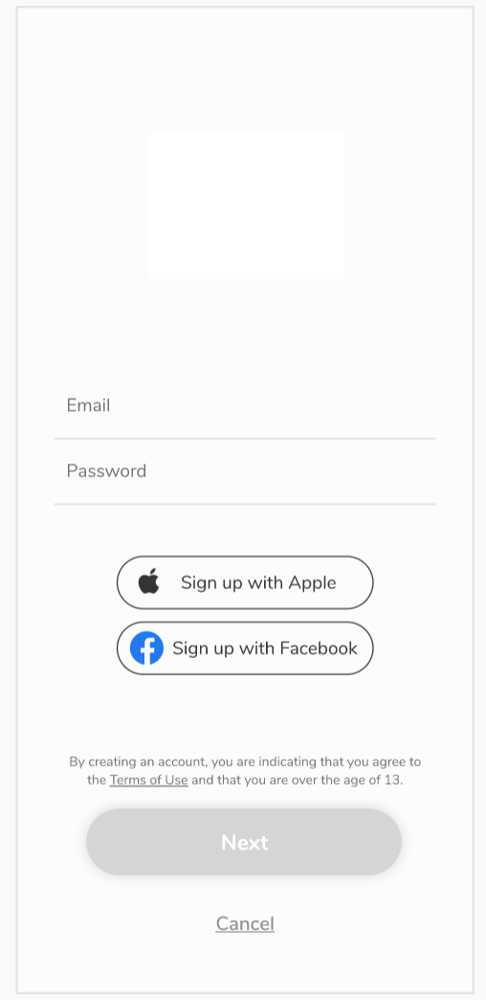

# react-native-assessment

Create the following screen. It should exactly match the design.

## Requirements
1. Do not use class components. Hooks have everything you need.
1. Use a type system (Flow or TypeScript)
2. The screen must be scrollable when the keyboard is up.
3. Once all fields are filled up, the Next button should be enabled.
4. Every time the keyboard is active, the Next button must be above the keyboard at all times. To better describe this requirement, I have uploaded a video from the Target app to demonstrate this:

* Prior to start of the task, please give me a time estimate as of how long do you thing this could take you to do. In addition, please record the time spent on the task and provide that upon completion.
* Please fork this repository and create a PR with description and send me the PR.
* Contact me for addition questions/concerns.
